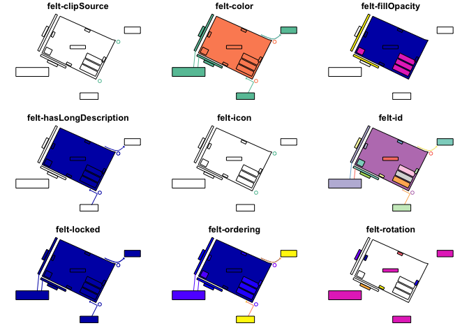

<!-- README.md is generated from README.Rmd. Please edit that file -->

# feltr <a href="https://elipousson.github.io/feltr/"></a>

<!-- badges: start -->

[](https://lifecycle.r-lib.org/articles/stages.html#experimental)
[](https://opensource.org/licenses/MIT)
[](https://app.codecov.io/gh/elipousson/feltr?branch=main)
<!-- badges: end -->

The goal of feltr is to read maps from Felt as simple feature or
`SpatRaster` objects.

## Installation

You can install the development version of feltr like so:

``` r
pak::pkg_install("elipousson/feltr")
```

## Example

``` r
library(feltr)
## basic example code
```

You can use `read_felt_map()` to create an sf object with features from
a map URL.

``` r
url <- "https://felt.com/map/Site-Plan-Example-PGTipS2mT8CYBIVlyAm9BkD"

site_plan <- read_felt_map(url)

plot(site_plan)
#> Warning: plotting the first 9 out of 22 attributes; use max.plot = 22 to plot
#> all
```



`get_felt_map()` returns a list with basic information about a map (set
`read = TRUE` to read map elements and layers at the same time):

``` r
get_felt_map(url)
#> $attributes
#> $attributes$title
#> [1] "Site Plan Example"
#> 
#> $attributes$url
#> [1] "https://felt.com/map/Site-Plan-Example-PGTipS2mT8CYBIVlyAm9BkD"
#> 
#> 
#> $id
#> [1] "PGTipS2mT8CYBIVlyAm9BkD"
#> 
#> $links
#> $links$self
#> [1] "https://felt.com/api/v1/maps/PGTipS2mT8CYBIVlyAm9BkD"
#> 
#> 
#> $type
#> [1] "map"
```

You can also use `read_felt_raster()` (a wrapper for
`rasterpic::rasterpic_img()`) to create a `SpatRaster` object from a
“Image” type feature in Felt.

``` r
image_map <- read_felt_raster(
  "https://felt.com/map/feltr-sample-map-read-felt-raster-oiinodTbT79BEueYdGp1aND",
  "https://tile.loc.gov/image-services/iiif/service:gmd:gmd370:g3700:g3700:ct003955/full/pct:12.5/0/default.jpg"
)

image_map
#> class       : SpatRaster 
#> dimensions  : 655, 764, 3  (nrow, ncol, nlyr)
#> resolution  : 6439.813, 6439.813  (x, y)
#> extent      : -12209153, -7289135, 2474851, 6692929  (xmin, xmax, ymin, ymax)
#> coord. ref. : WGS 84 / Pseudo-Mercator (EPSG:3857) 
#> source      : file82c85607acd5.jpg 
#> colors RGB  : 1, 2, 3 
#> names       : file82c85607acd5_1, file82c85607acd5_2, file82c85607acd5_3
```

For more information on the Felt Public API check out the guide to
[Getting Started with the Felt
API](https://feltmaps.notion.site/Getting-Started-With-The-Felt-API-69c8b02b7d8e436daa657a04a2dbaffa)
or the [Felt Public API
reference](https://feltmaps.notion.site/Felt-Public-API-reference-c01e0e6b0d954a678c608131b894e8e1#1e9d31b9ef6c4b23be41938f93aa46ad).

## Related Projects

- [{feltr}](https://christophertkenny.com/feltr/): A R package with the
  same name that provide very similar functionality to this package.
- [felt-upload](https://pypi.org/project/felt-upload/): A Python package
  to upload data to Felt.
- [Add to Felt QGIS Plugin](https://plugins.qgis.org/plugins/felt/): A
  QGIS plugin for uploading data to Felt.
