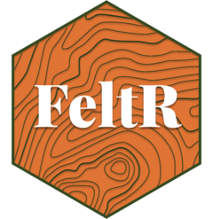

<!-- README.md is generated from README.Rmd. Please edit that file -->

# feltr <a href="https://elipousson.github.io/feltr/"></a>

<!-- badges: start -->

[](https://lifecycle.r-lib.org/articles/stages.html#experimental)
[](https://opensource.org/licenses/MIT)
[](https://app.codecov.io/gh/elipousson/feltr?branch=main)
<!-- badges: end -->

The goal of feltr is to read maps from Felt as simple feature or
`SpatRaster` objects.

<div class="callout-note" collapse="false" appearance="default"
icon="true">

## Package does not support the Felt API v2

This package does not support the Felt API and, as of December 2024, I
have no specific timeline for when the package will be updated to
restore functionality. Please use [the feltr
package](https://christophertkenny.com/feltr/index.html) (identical name
but a different developer) for API access or follow [this GitHub issue
for updates](https://github.com/elipousson/feltr/issues/2).

</div>

## Installation

You can install the development version of feltr like so:

``` r
pak::pkg_install("elipousson/feltr")
```

## Example

``` r
library(feltr)
```

You can use `read_felt_map()` to create an sf object with features from
a map URL.

``` r

url <- "https://felt.com/map/Site-Plan-Example-PGTipS2mT8CYBIVlyAm9BkD"

site_plan <- read_felt_map(url)

plot(site_plan)
```

`get_felt_map()` returns a list with basic information about a map (set
`read = TRUE` to read map elements and layers at the same time):

``` r
get_felt_map(url)
```

You can also use `read_felt_raster()` (a wrapper for
`rasterpic::rasterpic_img()`) to create a `SpatRaster` object from a
“Image” type feature in Felt.

``` r
image_map <- read_felt_raster(
  "https://felt.com/map/feltr-sample-map-read-felt-raster-oiinodTbT79BEueYdGp1aND",
  "https://tile.loc.gov/image-services/iiif/service:gmd:gmd370:g3700:g3700:ct003955/full/pct:12.5/0/default.jpg"
)

image_map
```

For more information on the Felt Public API check out the guide to
[Getting Started with the Felt
API](https://developers.felt.com/rest-api/getting-started) or the [Felt
API reference](https://developers.felt.com/rest-api/api-reference).

Note, in July 2024, Felt [announced the pricing for subscription
plans](https://felt.com/blog/introducing-pricing) that are expected to
limit API access to paid accounts starting in January 2024. Educators
can also apply for free accounts to retain API access after January
2024.

## Related Projects

- [{feltr}](https://christophertkenny.com/feltr/): A R package with the
  same name that provide very similar functionality to this package.
- [felt-upload](https://pypi.org/project/felt-upload/): A Python package
  to upload data to Felt.
- [Add to Felt QGIS Plugin](https://plugins.qgis.org/plugins/felt/): A
  QGIS plugin for uploading data to Felt.
- [feltpy](https://github.com/moss-xyz/feltpy): A lightweight Python
  package to interact with the public API of Felt.com.
